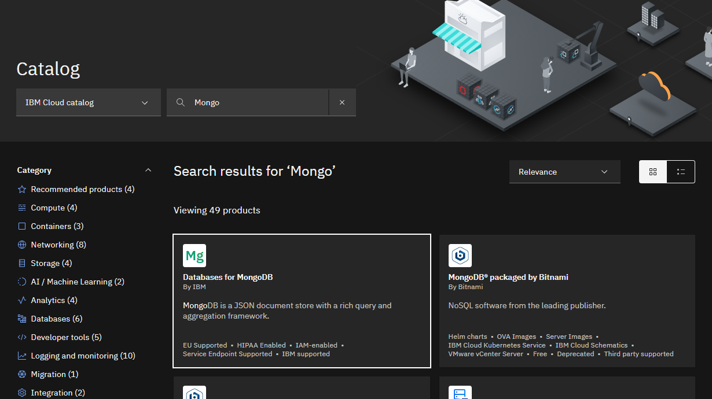
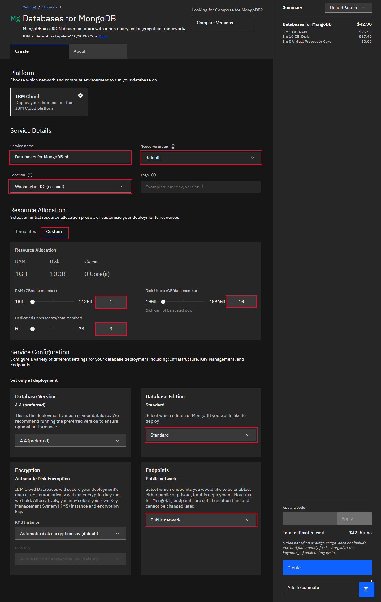
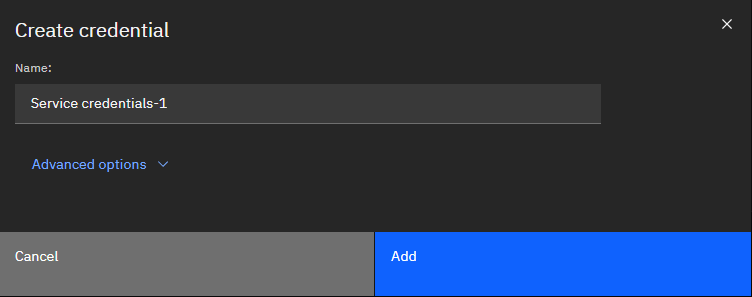
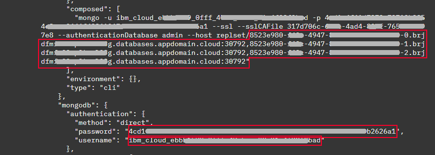
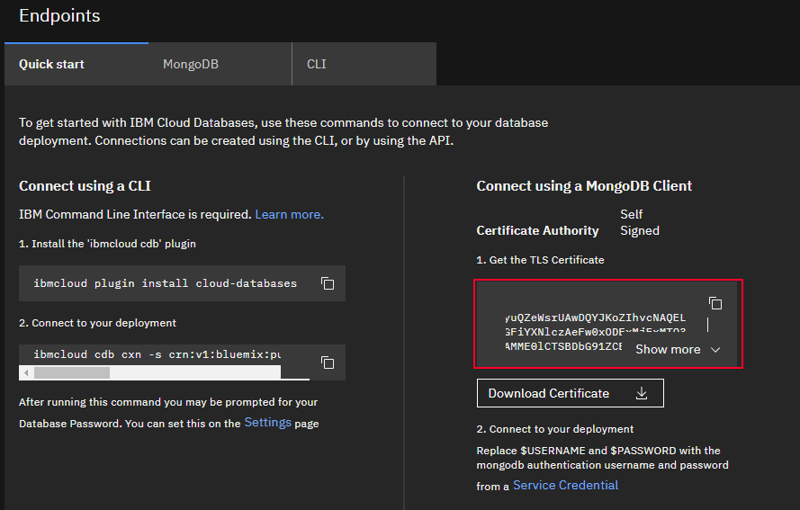
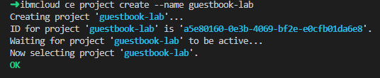
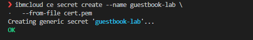
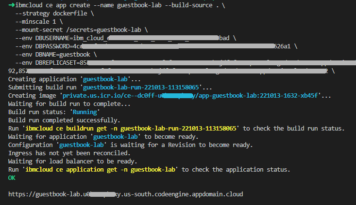

# IBM Cloud PaaS Lab

This lab will introduce the steps to deploy a cloud native application that integrates with a database. In this scenario, we will be deploying a sample guestbook application, built using nodejs, that integrates with a Mongo database.

## GitHub Repository
The application code and Dockerfile can be found here in the [nodejs-guestbook](https://github.com/mcltn/nodejs-guestbook) project repository.

## Pre-requisites
We will be using a mix of the IBM Cloud control panel and the IBM Cloud CLI. You will need to make certain you have access to an account where you have provisioning capabilities as well as the IBM Cloud CLI installed on your workstation.

Install the IBM Cloud CLI if you do not already have it.
[IBM Cloud CLI](https://cloud.ibm.com/docs/cli?topic=cli-getting-started)

Confirm that you have the code-engine plugin installed for your IBM Cloud CLI, and install the plugin if you do not.
```bash
ibmcloud plugin show code-engine

ibmcloud plugin install code-engine
```

## Overview

The first step will be to create a IBM Cloud Databases for MongoDB instance. Then you will deploy the application using IBM Cloud Code Engine. Last you can then alternatively deploy the application using IBM Cloud Kubernetes service or IBM Cloud Red Hat OpenShift.

## IBM Cloud Databases

Let's create a IBM Cloud Databases for MongoDB instance. You will navigate to the IBM Cloud catalog and select IBM Cloud Databases for MongoDB.



Once you select Databases for MongoDB from the catalog, you will see the order screen for Databases for MongoDB.

- First name your instance by filling out the **Service** name field
- Next select the **Resource Group**
- Now choose a **Location**
- Next, before setting **Resource Allocation**, change the **Database Edition** to **Standard**
- Now you will choose to modify the **Resource Allocation** by selecting the **Custom** tab and setting the values to the minimum, as shown in the screenshot below.
- All other values should be able to be set as default values, but be certain you have your **Endpoints** set as **Public network**



Now click **Create**

Provisioning of the service will take approximately 20 minutes. Grab a coffee and check back soon to continue....


Once your MongoDB service status has changed to **Active**, you can now click the row and go to the MongoDB instance detail screen.

In order for the application that we deploy later to interact with the MongoDB instance, you will need to create credentials. Click on **Service Credentials** in the left menu. Next click **New Credential** and provide a name for the new credential you will create. Click **Add** to create.



From the credential, we will want to collect three main variables to use for the application. Expand the credential to see the values. Look for the **composed** section and collect the **username** and **password** as well as the **hosts**. Be sure to save the full hostname and port for each, you **do not** need the replset/ part.



Go back to the main detail page of your service by clicking **Overview** on the left navigation. Next, scroll down and look for the **Endpoints** section. Here you will need to save the TLS Certificate information. You can do this by copying the text, or by downloading the certificate by clicking **Download Certificate**. We will save this to a local file to be used when deploying the application. The filename for this will be **cert.pem**.



This concludes the **IBM Cloud Databases for MongoDB** portion of the lab. You should now have a database instance running and credentials to be used for connecting an application.


## IBM Cloud Code Engine
In this portion of the lab you will deploy an application from a GitHub repository to **IBM Cloud Code Engine**. These steps will be performed via the **IBM CLI**. Please make certain you have the CLI installed and have the appropriate plugins added, in this case, the code engine plugin. This application has a dependency on a Mongo database (which you should already have deployed) and has required environment variables. Before being able to create the application within Code Engine, we will need to define the values for the variables by setting up a few local environment variables that will get passed into the CLI command for creating the application. You should have this information from the **IBM Cloud Databases** section of this lab above.

```bash
export MONGO_DB_USERNAME=<YOUR_DB_USERNAME>
export MONGO_DB_PASSWORD=<YOUR_DB_PASSWORD>
export MONGO_DB_REPLICASET=<YOUR_DB_REPLICASET>
export APIKEY=<YOUR_IBM_CLOUD_APIKEY>
```


### Clone the application repository
You will start by cloning the repositiory to work with the files locally.

```bash
git clone https://github.com/mcltn/nodejs-guestbook
cd nodejs-guestbook/
```

### Login to your account
If you do not have an API key defined for your account, you can login alternatively using your **IBMID**. Just be certain to target the appropriate account.

```bash
ibmcloud login --apikey ${APIKEY} -r <region> -g <resource-group>
```

### Create a project
Create a **Code Engine** project to host the components for your application. A project is a grouping of **Code Engine** entities such as applications, jobs, and builds. A project is based on a Kubernetes namespace. The name of your project must be unique within your **IBM Cloud®** resource group, user account, and region. Projects are used to manage resources and provide access to its entities.

```bash
ibmcloud ce project create --name guestbook-lab
```


By default, the CLI will target the project, however, if you already had a project of the same name or coming back to this step later, you may need to select the project to continue the steps further.

```bash
ibmcloud ce project select --name guestbook-lab
```

Check if you currently have a container registry access secret defined for the project scope. This is used to interact with the container registry. You will not need to define a namespace as one will automatically be generated by Code Engine for use.
```bash
ibmcloud ce registry list
```

If you do not have a container registry access secret already defined, you can create a new container registry access secret using the command below.
```bash
ibmcloud ce registry create --name myregistry --server us.icr.io --username iamapikey --password ${APIKEY}
```


### Create Secret
Now that you have a project, you will create a **Secret** to store the **cert.pem** file contents which will be mounted to the application as a volume. Copy the cert.pem file you created previously in the **IBM Cloud Database** portion of the lab, or create a new cert.pem file with the **TLS Certificate** as contents into this directory. Next, create the secret.

```bash
ibmcloud ce secret create --name guestbook-lab --from-file cert.pem
```


### Create App
Now you are ready to create your application. This step will create a new application using the contents from the Dockerfile of the project to build the application and deploy. We will set the minimum scale of the application to **1** so we always have a single instance running, however you can set this to **0** if you wish.

```bash
ibmcloud ce app create --name guestbook-lab --build-source . \
--strategy dockerfile \
--minscale 1 \
--mount-secret /secrets=guestbook-lab \
--env DBUSERNAME=${MONGO_DB_USERNAME} \
--env DBPASSWORD=${MONGO_DB_PASSWORD} \
--env DBNAME=guestbook \
--env DBREPLICASET=${MONGO_DB_REPLICASET} \
--env CERTFILE=/secrets/cert.pem
```
You should now see a **URL** presented to you in the output in which you can navigate to in your browser and see the application running.




## IBM Cloud Red Hat OpenShift

### Coming soon